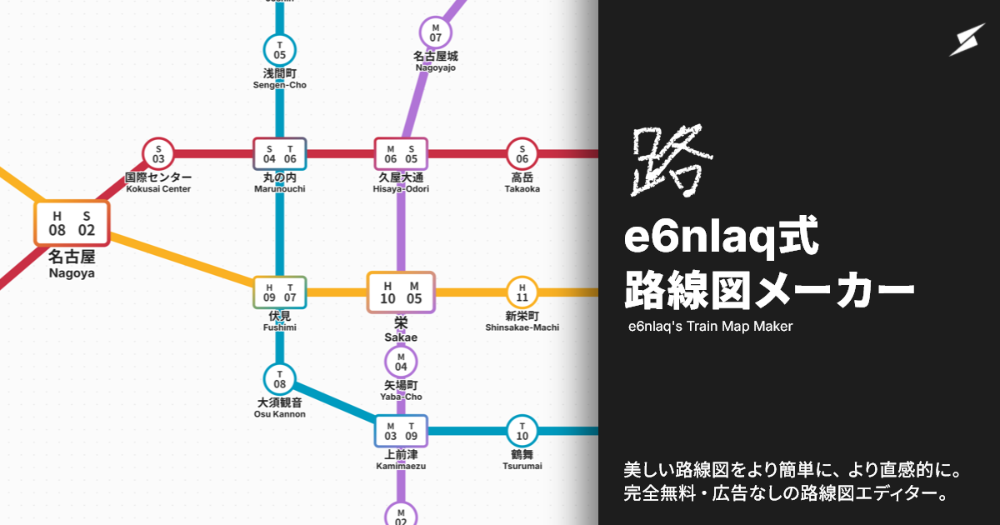
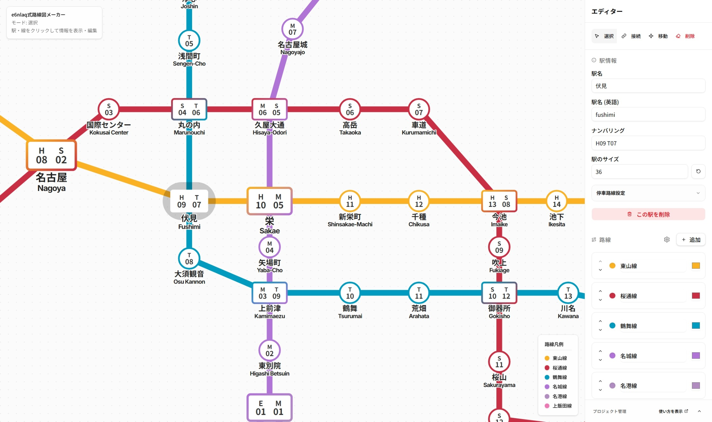

# e6nlaq式路線図メーカー (e6nlaq's Train Map Maker)

[](https://e6nlaq.github.io/trainmap-maker/)

### https://e6nlaq.github.io/trainmap-maker/


## 特徴

- グラフ理論に基づいたUIで、シンプルな操作が可能
- モダンUI、モダン路線図。
- png出力
- ファイル書き出し可能
- **完全無料、アカウントなし、広告なし、オープンソース。**

> [!NOTE]
> このプロジェクトの大部分でAIを使用しています。事前に動作確認をしていますが、バグが含まれている場合があります。あらかじめご了承ください。

---

## サンプル路線図

実在する路線からサンプルデータを用意しました。「プロジェクト管理」から「共有テキスト読み込み」で以下のテキストを貼り付けることでロードできます。

### 名古屋市営地下鉄

<details>
<summary>共有テキスト展開</summary>

```
H4sIAAAAAAAACq2ceZPrxLn_38rU_P7FVdps2ec_76u8yfutWy7JkiVZlmRrsSynUgUcCGEPCQlZWE5yD-SGJMAJBA4kubyYYc4w7-LWhLHaandfeU79_gO-lJ9Ptbr7efpZ5kfnjiu4mmU65_d-dD4RapPBuJTcDLMJcswbzEYYJm4ETTq_h1GfOTcFQz6_d375s9cv33x4-ejV2_9UNM_vnZuCYgXCzX_xDFG2NVM5v3deIdJnPEGdP3O-Pb_HpolnzoPzewnm5h8cbSef30uSz5xLmiOIS1lqaKbsnN_7j__88TPnrCqOtyO1v6iZjLtIZXIjsVAJ-dBqyPfdN89efv7lIZwuGPJCM47x2B_QUswtWhKg0SkMGkE1y0xhGJT18bRXXta3OTkL0JAqQPvnm99_FFm3ueeomqEdkWXOens6kqD2K0fE4rUbKaWeSuq8liissma6vS5X2yEeWg3xnrz7l-vf_NchnmqZC808okv9QMZQp6_bwOf4QbZBm3bRLeRtQikQIykEQ6tg3R7_9cl7bz1558Pv__4wuut0wfBs4czUHEfWj5cxCYEyTCzoWGWX5igz08f5SUC3fHbYW09DULQKgV6--JfLd3-OBNUt-Xg5GYiSpmIpTWKUq_FNhdYamqlUl5V2sdQJKdEqOMF_-9Pl7397yKf5gut4-vEJoSE0MhWLNkt11VrCVzWNzjjEOMclFkNwQtAqQHvxz1dvfxbZgoLrHnNREFc8VkOdj8RUlpoNhrXWWEj1h2MWnAy0GmJd__nXV7986xDLFXRBFBBkZJQsHizbNlpmac6XuexETzWnWlYqKCEYWgVH9sELh1SOoAsyjEQSZ9z-JJD__oDQZcJgyKqSN_f0MVFKEDtaXhNe3x6sQjK0Csh-9dmTBy9cvf1NhE_VzH8zJgxhph6dV_J28UiaOP3K47wdV3OmzqzADppDnnTzVLUYUqJVsN9ev3_1358cIs5UTfeco-9K3u44krnDbTxS_BJne3q1WByl8g7He20B-DG0Cu6Sf7zy5NGDyCk1BE0__rz0GU-kb-mSiM-Lo_M37VZzyzNBptJcjv3axtysAB1aBZ_30YPvHkdcmabLjnZ8IMjb241M3QGtVWlklv5YrpliJZ8n6Y6bM5IhGloN0b7_6LdXb7x6-ehRNAbQPWsnHF2-5P5gsHfAI2paIrkjNn4nSAbjhZNqZjg-xEOrh14WYjMs1wqE4_iETJ1x5D4KyNzhSPRKvkSPs530OM8nkl7S86paPuRDq4DvvUeXjx4d-zBVUwRH1W5AkW5sT0oRdyCVC6OGkK1txoN-xSHW2alQkvSQFK0C0l9_cHH_y-8e_zoasjg3pNaxMyNvDwlF3uEIW1vaStMJabikBuRuR68Vdt0NAdHqQTjw7NXD_4kcEsdRj8Eyt2AUczpYmm9UBaJTY9uSwGZ4zRdz1CQEQ6sHYK9AYLpgaMHN97UtGI8ibvHo9Ol4paxnSAU70Fazcm1HWU19afdCPLQaCUTvfwUFosox2K27oJg7gBnEbt7St9P1NldUyGSTbDdIIgRDq-BqeefhxXOvQTtu7i3QG4669RlU6g4nwrSsTGGkLcRgIM4yzVxSSLMgUEarwJ09_Pj6Vw-vn40Ed66g6VZCsmzY3_L7YCV8ANHx4YrjSuw4V9jt5FxTTaaGJUaqr0M-tAr4fvev69_-7uL5f1zc__zi-W8v7v8zsgetG8-rnc1k05XtI9jbWDS9_9jJeFhZz1Zoylv061prTAy2gZzxfXC9INWDQ_L44rlPLn_yYuSuFmzPtLzj4IUnmLPe_mUE3mwnQGqLzKJLaSWqIJoFruE2N5vEMIREqwDy6xcvH716-fCP0EdXNUcIhISF_OzJMy4kDQPCE0grBjtbqvUyJ5BzimQr3LAcOCEpWj2MoS__9jkcQx8fGz5EC6PAE9D0jG9XmE21kPVqpYqRV9fFCtiWaBUc63-8cv3cLyJb0bM9QzA01Hdm4UjwBLzakGWGU1vLjPk-IwVNp17M90M8tHqQcfn6u8evRK8cXRMUOBTkiQwcBp7wlCzNZddNFReVJWnpsrnZ9m0PxM9oFdzUf3_x-le_gKN82VRkMzFT4Ru7Fz5DwvORik8dzMpaywuqQa6STCz0RimTk4wGeFAi1QPAFy6_vX9It7gJEODopbd_hAMyNp7Mcsvzcc7erN3kLNkJnJy2rjEgOECq4Kt-88LlT16Ejq2jWqagoS7r3v7-A4TpeEJqbCmjVdUKmgV9W5l0ss0ZBV69aBUivPrqrct3PzuOB39APbMDS7-5DlExYW__TgfMmfizktrNR0SJVrPjak6a-rvlbDY1Q2a0ehjZXH725tXbn333zS_h-MZyheNVJWFCkohHbCVyNX3XKujpISWKXFFedddL8D5BqgdO-o_XD376_UefX38QuQ4txzvTBdO0jpcxDUPS8YEEWRKW7rSb01N6nW10aVmkFmrIiFYjy_jy60---BBeQ0OQd94RX-aMC7dn6FCo-GSbwXhZiVq4RrJQHrmeR9jtFtieaBWs4__8_vI3__3k5WcPGRVL15zji4ekzniSgG_HEwgDUieDRNNecDtr0tLImZrusiEhWgWEX713-bPXo0voCybs8Xrkfu1S6dPJFNOh0o1OUePSXiUpKptpgQYvE7QKnPGXX3z_0_cjztj5t8s7OiDhqoXe-AS2QrEttrcJbVgfZN2hQ85Ly8YsZEOrwBu__nMo2SbYgnqca-uF6aLQE5-Alptb41KxyjWFYXJUVmVtopAgc4pWgTf5_bvQ290RdM8WEK93PqQLtxsZ74wn1Z3uZIZ1xdbcdKIzZDw1D14naDWku_rgD5cPvoCccSCIAsIVc6HDI-8QK9S7rl9LrcaOm99k6sV1JklaXoiHVo8LR5cfvHFcO1ocE-4DLWq_89j4Wy-bTxeIzHSZ3RUmiS3rcItAKIFsKlKNpD5--uH1b_6AyHucibLreEeBAxe6uHAdyfhNOLTtzpgiFCff0EqDrjyvcVwmpESr4Oy-9NZRcstEbUGOIM-KoYM7yPzGJX4XhVZvvp4y6UmSCDo8W6DbMojz0WrkM3_wxnG8YMjawkJFCVzo3qj99ZeO_9CqzKVtpb-h-lLXmhaLgTfsaSEjWgVL-I-fX371HhTwWzeX8xHbPqQOkx_p-PBg2cyK1tRY7EarXmYtEFOnWQeZVbQK1u_bd77__NmbFAgcGmqKkFAtExEccsC3hYFW_BIK3aKza8qTOa_2JyMv303XVZDfR6vglv7w2-s___r7t_8eOcrazUm5edfd3IowJBV-59t8Q3z8uirZVF_g15NRq9RpLubZ_HYD7kO0Co7zOx8--fTt65feiB5nUTPhu6YIAtX0qWiqkVtlFM8smFq1NJ03O-1-CYSpaPWgzvXXq19-DF3VtqV7ooB6OBVB8H97F5LxgO506Lr2iFXzHXdUFCSWmZogiY5WD6_CJ3__Cs4kWTr6cVLce5PM6XjzbUNg26LHug1xuErN696uDnwJWgV4jz-9fO2by399DYV_hmYKrnWme4Gge8dxYHH_AN13I5zA6S18qzP20vmEJa13okawkxl45KFV4JI_ffnm8fRmpKp-U2rVFlpCQaSRivvsx75ccgKhkii4LNcZbJj-WlWSSyolsFsQCSLVY6_85PGnx15ZP17BW6-cPJ2PoSmt1CTZSnE-k_gm0W-KIniJoFWwgm-9f_Wn5zEfe-ep-I_NhzU7EPDHe2ZuQ9aXtpvrLnKS2yVSldkQ7Eq0Clh_8ujq7c-uPnz_8pNPvv_w20gI6zqeK5wtNFPxzv59TR7djvtwh769wk-II9R606BbgtwsJk1rtU2WVdqdgzsIqSJpv_vne9cf_QW6jyLMrmwYyECS2qfrmNtVpuI9z3jgBwrnpZ3OutYpynnS8w9q3mgV7NgHz8I9ApZ9XHnkqH2yKXW7oFT85xe3E7o_4BvZireiEmZA-s4OgKFVAPbRb64_-By6M43AskzUnclR-wj8DpdRftNvpmRhtcuMAn65KycNQQYfHK0eluSv3nr_yZ8iZVvBFlzBEBKicLwneZI546i960mf7Bp9Q6uP6m2tIHZcimsU1xUzCw4RWoUO_PVzr16--svLB19A5-j2zHumZC0s5EHiw9c0e_vd41e1WqtossCXqjVFKNfTveG4AYpVaPXwTfjkXfjo_PAsTKiWgWp04PdVZ4o4ORJyR9m5umOstmWU82WrlPaH2RTw5kgVt6ZP3nuEX9Pb987Rbt1fpnsXH1_XaKZayrpX647k_ohJtmoBS7qgroFUQ-KL5164eP6Vi-c-vngu2mVgazfNVEepAPgsJU447BWBdYTUrO7kOlN6srLoxlgGWTy0etip9N03EbRAUCz3OPOUPOP2FVRQxD-hj0rn86ORpC_mgzUvMoMONbIskN9Bq4Du93-6fuldKO5wVM1Sbs46KvDokan9nrxDs1ePWpX6XLo84Cu1ZDM353vVtgE6DZAqODkPX4cuck-Wjj_tvq-ATJ_OxZfHfl5TuTLboqa5ToJhPRpkedAqeNq89PHV24-OWwsWWuChCr3cfunA903G7z4yn91xal3uNuY01VzVG0RnSoH8LFIFB_qrNy9_9tOL-x9f3H_z4v4vbv4BU1R1LMU6szVVEDUbU1rl9oV0wB9_Hw3TBXu6m9XZpO7W18zMbs6LYxAoIVXo8Bw3dP5whDDtnNy-TwJgnpDvSyQH_YwhOyXS2_KqR01lZ2GHnGgVkbJ6-MfLv350HB-fSYKmCDqcEef2vSYA9YTsWqoi9LYTZl1OWSmptS3nUkkPNMOgVYD6xgeRkEg4en_3wgYY-g7X0KzG7Jak1GxaQiqf1_OpeqckgOobUgVQX39-_VIkz6JqtiAKx9WtsAeGYU5nq6ppUaowbZX3h6mu3TXmo7IMGhSRKjjlf38I9dcJOqK_rhe2v4A8bjxZV6t6WnbS3eUL62UtsGfKTAAJPrR6uGqXn7wMF_RlTUDHkSR5Vg_zF2Erxwn5n1qmkSsbOS07cG2Ro8aj8dTfgKI0Uj2sYj353b-ePPg6UsLaWSa8gFz4DGPvkEJTSVOZ9Id0zy9YO3OaYBPTgwVEqyB4uP_KxfNfXNx_eHH_5Yv7_7y4_-Dy5devPvgD5G32R9gybvpR5bNAOPI-HAlHv6fkJlOtdjrhFHveemGSAV_OFn29BQ4yUgVX-4Pnr97-DIrSHc8UJHSQzoWxT3jXsPF3jd6hm2RQysxdi3S5cSNwW12QvUKr4Oi89uXlo1cv7n95-d7zh5QzVQgERXCOAzQu7LMMIVPxkPO27jJ5ucAUaKa5HCTT3XGhDFJESPWwhHn9X59Cn_ymhKlpR5-5HmbJw_PzQ6015jtPaJWe-e16xeHsZWppDLvBCHxnpHpYgrt-6TUoL2R7jnAUQ_JhaLbP4ce7Z66hjGSJ7iSmNZdpDaTMziDA2UarBxWGN757HPV2likcjanwYWhGncyVloc7Pz2u0Jbg1AObDAj-4OWPVgHX519c_vVnl6-9Ez3FtqdbZ_pxBoAHDu9kvhoxU4ZjIbHM9ySOLNMrze0AH4xWwdH93eOrtz-AijOCZmnI-iDs8eLhtrVpYyXmm9lcm2Eam26XCGZgtAKtArgP33_ytz_Ah8E5rnnwwOOdTLajhzM9Y5YsigwE22sniK0Aglm0elDI__z6pUiZ3L3pBFS14w6nsOVzn9OJQ7upxvzwLz86X-jSRiBccbPxsq3mig9GXACuE7QaqQ0-enT11Y1TnllLyz6_d_7_5oJIUvT5TadhYtGvt5e0PQtMYt1PVReTCWgJR6uHKYTrZ38L_fYsQ80Z5ua3R7nyTpNrBdFreEZtSg5TYhqE2mgVqvRDv00QGVGc3_x2pjUvbsfGrM6RA7OVLQ0YtgEeSmgVKvVBvy0SLCOlbn675i_F-Ujc1kvOXOqynTqnlEDvBFo9_O0njz89-u30bEbc_HauZuj9mbSd5uhq35okeWt10CaLVo9dA_Tz8oxNi8z5zaaRJeWHTaPKApFcBDU6VyuZ6mLIuqV-_aDOiFKf2U9bktX_a6Dy9n-iqv_X6ODN7q3i9-eNl0zv2k0ytVSsOZcitlPBydI54CWR6lMRYuYu4wmt0UxzatNMJ0frsx7f6frGALzB0CpEiDMeIcTNN8YTUoKxGs5Ec8P6ycx2I3hC17VAnxxShQhxxiOEuEHHeMIFtV1JTXeZSVIVKUiafq01A0UetAoR4oxHCHETjvGEpORzdd70K_ZyOnEL62E3Y-1AQgOpQoQ44xFC3HRjPOFa1FPVSTO_XvM7bjMbJrq6AFpd0SpEiDMeIcQNOcYTbtpNoWh0KW-8NNgKRdJyrgZqtmgVIsQZjxDi5h3jCZOcvZjKs2qDSY82bM5ULEMFLfVoFT7LmKsuQogbfIwn9ISgm0_mx-ZskmQ3bH9eHPrg6YhWIUKc8QghbgAynnBJL6dJxSosZd0Y0yk9mZAF4FPQKkSIMx4hxA0_xhPSors1VJbZmWOtvV2yo21nB9YQrUKEOOMRQtwMZDzhqucEc71m9OUhrUr0JJCSTXDboFWIEGc8QoibgzzhtpFWibFcTQfkZLYuFjnDZz0QtqFViBBnPEKIG4eMJzRSHM8S7THlD6fyTFpsHZYmQfstUoUIccYjhLiJyHjC9GpX6IucnFCMguyRPC-yLMikoFWIEGc8QoibiYwnnHiK12EHgV_rKFW7kSOq4yLolUOrECHOeIQQNwsZT9hrJydug0mTGVbYemOF3vkT0H6BViFCnPEIIW4YMp6QL48auemk4xCa1ywqvUrWd0EVCa1ChDjjEULcVGQ8YWEltnVBbrFKvzGoeY1aY6eAPjS0ChHijEcIcYOR8YRCqd7XJgpHe6WWPxsPNlVlC1qu0SpEiDMeIcRNSJ7wCqjqa23cLa3Hna7Kdpp8RpqB5zdahaMvzPhjhBD3mAkJ0a_xm33IZ8xgQWTXKy8l0W1_xS6HNbAPkerTvKRwU5LxhKUeIROi78-t0m4bTJPTli-AJzVahQhxxqO3DWY0Mp5Q6mac5VxOpiuG2640mSZb3YC5ZLQK3zYY4xFC3FxkPOF23q3Us6nlMChpJEMOG_ZWBWuIViFCnPEIIW4eMp5wPE0ulpVBxWcyGyZHqkSrR4B9iFYhQpzxCCFuLDKeUPTam8zAVDtT0mWHHS_X0DiwhmgVIsQZv1t8iCXU6dquMWNKa8FOGDtxwxQXNZAAR6tPEx_iZjfjCVcDhi27NJ2SxWR_rU3oqS2CyipahW9szHRm9DWKmZAMCdEZxJt3Sm7EVZIbvcAPg_l6NSMJwwTdZmgVfo1ijEcjB8ykZDxhcuTVuVo3zw9Ef-OUqzVdXoH3MlqFIweM8QghblIynjDhtfjh1KOYqbfdGD267o6MAeg_QKoQIc54hBA3FxlPONpV5js2FeTWbNtpTycy25RAZxlafZp9GOtTsISVxnQ04Zx0a6MYzbpiDnJLA-Rt0OrT-JTYHCyWUJxUR8X1slMYjTrrcmPJpMcdkEZHq0-TFcGNlsYTasPNrtYnE8RC92tclh1oegq89dAq_NbDGI8Q4gZL4wklj96ZqeSubJiTzcia9grWEnSNolWIEGc8QogbjTxhH5LTdK40IrJKb1hR9Mw22yEBIVqFCHHGI4S4AclTbpvqsNmUim2vnWn5u35NzPb7B7cNSoUIccajrwDMaG48ocNI-nDDVBjPmi-XvYXRmSRA4QatQoQ44xFC3GhuPOGcN1TbWad2I8kvzWvaLmelgU9BqxAhLii42xpiI4dea7r17UrSrnZsrrGrG4LGgH5ltPo0a4ibhj0hPuxI_SKdLeWrkq0VKGFN8zJ4BaBViBA3TXq3VwC6gvnjZ877Ojfqka20tVL7wwTfLA8qmUVIiFaf5hUQm8fGEioTTS9Xlt622a4VDG7TL85UQIhWnyaPjZsqjicke0KbKs63ks0QaTvbnQVT9qDig1Th9zLG-N18CpZwQ5o5kU4WA7-_Xglig2irB51YaPVpfApusDiesOLVsnk-rVM6V6S9STtXEiogPkSr8FfGGI8Q4oaK4wnznh-QU2ZaM6niSM4zrXJAgT5-tPo0Zxk3VxxPuDTL2wbP8YJK6UW17Y_6RgY08qNViBBnPEKImyqOJxyXJI2uJ-0tXxlli0tz3vF1MGqLViFCnPEIIW62OJ4wWJaYDTVZ5sbbVb-5odbTZBFkidEqRIjbYhFC3FhxPOF8XNhOZX67dFeTNeUnrG6hCkb70SpEiBsYjn5lzOhuSIjuXLn5G7MbqpSbldrdBSPzpLBYcamCGBKiVfgrY4xHCHGzu_GEgdBj1UyKHBd6wXzT6PXrDQ5kRdAqRIgzHiHEje_GE9asKV2qZgdLJSDoqTNe8BsPdLOgVYgQZzxCiBvcjSe0KMseDOu7acKpVAvt6W7LmOCP1qBViBBnPPpOwQzuxhO6W2vWLmgbviGyFVlobAImB2JstPo0JyXWp2AJPXfqmG5ZlUnNkwQ1ybhTAbRZolWIEBecRghxw8XxEay3yojrbKJXXErrRH5T3lq9Foi-0CpEiDMerS9jpiHjCd0s6Yys6mRFVwPLDhITItEGLYdoFa4vY4xHCHFTpSdUK4Z2zaxvWLI-pNsLvt1cDElwH6JViBBnPEqImdCMJ-Tqsrxka_1SUS6afKLFTlsFEDmgVYgQ59CiJwUzOB7v9ToOPd9OmulsVezmm22y01hUwN_yRauwX8YYj3o9zLB4PKHDB5pWXDmMQQuJZt53JqU1uA_RKuz1MMajnWmYsfB4QsH2GZbTzWmmUB1P-9Iy18zQoDaKVOHONIzxCCFuPjyesC7xHO0ldoRn6k3HVCli0wd_4xCtQoQ443c7y_i3Hk2Mu8Z2nC8vG1IilWiOhhIH3npIFSLEpWSiL3rMXHB83qYtLwKj3rPHqf48k1uupv5yAirgaBV-0WOMR-t6mMHgeMIuJXQaSjqbaxR3s4mQSyr5GvjKaBWu62GMR-t6mOHgeMK8OKjVS1az1GszFV8xxTWlgcgBrcJ1PYzxaL8NZjI4njAQ3UlmtlHnZre1nqlrkuPyoBaAVp_Gp-Am6uNPymDC5IfKbFudspVcRytt_GwVZEXQKhxjY4xHsyKYEeF4QrtaSKlMf6P0tDRdCVLSmiwBn4JW4awIxvjdTgqWUC45lXFq7LpzQnR722y2yBsHf7gZqT7NScHNKZ-QWVpM1iuvu6jNclaKVQmhmusDn4JWYb-MMR4hxE0oxxNy2VxflHJ1osv3uTyv2xvGAO9ltAoR4ozfrbsPS-iLvl2oZmpUjc4z0tCUrM4CfGW0-jTdfbh5_xNyX9tdrZRwPaWaSJpJxdH9pQNqo2gV7u7DXHXR6i1muPuE-5AbBINuw177ljIIXKYwtrcgf4hWIUKc8WgXAWbS-4R6SrbJ90c0Z2VSlYUgChk6w4JXAFqFuwgwxiOEuHnveEK_2XP0TSdZWq-7MyU1EqrNFujURasQIS7xFiHEzX3H70NtkWG6C0nbDPy2S5aqOcusgr8oiFYhQpzxaDcLZug7njAtpnVF6yTppZQstDo7oratHnTqIlW4aoYxHn2nYEa_4wlz7ipv65Os0ZsL8qy8I0kpA7qq0Cr8TsEYj55lzHx3PGEpkcm3G1VF8p2-IfC2Ma9KBfBeRqrwWcYYj8aHmPHuE15SotGdVbzdwE9MRHMyTwZDCWSJ0SocH2KM_3-6sddDllN1ccUKLNWeN7pt2jVAlylahfOHmMHyu51l9AzizV9OaUzS6tBS-xJRKjXWAplY-WD6A63CESwm4RHdh5j58_isSCLZKmgDWVrO-5THieOKyFdBVgStwvsQYzxCiBtDjycs99mBl_LMpD8zVH8rZ5eLVTokRKsQIc54hBA3kH5C_-FWz6u04ygZuj90LcXdFMbgtkGrECHOePTGxoykxxNOm6OBm80P-CCnMt7CVxW_BvoP0Sp8Y2OMRwhxc-nxhJZLJvq7bJ9SaLa1WNZHjWYWTJWjVYgQZzxCiJtPjyO8HS5v2ZJsn9_7D-wIOW78Gze6jRu7xo1Mo6-a__zx_wJjPePe9nUAAA
```
    
</details>

---


## 使い方



### 1. 駅を追加する
- キャンバス上の何もない場所を **ダブルクリック** すると、その位置に新しい駅が追加されます。
- 駅は自動的にグリッド（20px単位）にスナップします。

### 2. 編集モードを切り替える
サイドバー上部のボタン、またはショートカットキー（1~4の数字キー）でモードを切り替えます。

- **選択 (Select)**:
    - 駅をクリックして、名前、英語名、ナンバリング（例: `M17`）を編集できます。
    - 路線をクリックして、路線名や色を変更できます。
- **接続 (Connect)**:
    - 2つの駅を順番にクリックすることで、路線（エッジ）を作成します。
    - 1つ目の駅を選択すると、マウスカーソルを追いかけるガイド線が表示されます。
    - 2つ目の駅を選択すると接続が完了し、そのまま**連続して次の駅を接続**できます（数珠つなぎ作成）。

> [!TIP]
> Shiftキーを押したまま接続すると、駅ナンバリングを-1して追加します。またCtrlキーを押したまま接続すると、駅ナンバリングを受け継がない+停車路線設定をオフにして接続します。

- **移動 (Move)**:
    - 駅をドラッグして自由に配置を変更できます。

> [!TIP]
> 誤操作の危険性があるため、視点の移動の際は**接続モード**を使用することを推奨します。

- **削除 (Delete)**:
    - 駅または路線をクリックして削除します。駅を削除すると、その駅に繋がっていた路線も自動的に削除されます。
    - **__操作の取り消しはできませんのでご注意ください__**

### 3. 路線を管理する
- サイドバーの「路線」セクションで「+ 追加」を押すと、新しい路線系統を作成できます。
- 路線をクリックすることで選択ができます。
- 現在選択されている路線が、新しく作成する接続の色になります。
- 複数の路線が乗り入れる駅は、自動的に四角形のシンボルに変化します。
- 路線の色は路線名右側の四角い部分で変えることができます。

### 4. プロジェクトの保存・読み込み
- サイドバー最下部の「プロジェクト管理」から行えます。
- **エクスポート**: 現在のデータを `.etm` ファイルとしてダウンロードします。
- **インポート**: 保存した `.etm` ファイルを読み込んで復元します。
- **共有テキスト**: データ全体をテキストに圧縮することで、他の人との共有が容易にできます。
- **全リセット**: すべてのデータを消去して白紙に戻します。

## 高度なテクニック
- **複数ナンバリング**: 駅のナンバリング欄に `M17 C07` のようにスペース区切りで入力すると、ナンバリングアイコンが横に並んで表示されます。
- **設定**: 路線追加ボタンの左側にある設定ボタンを押すことで、凡例の表示等の各種設定が行なえます。
- **停車路線設定**: 各路線のスイッチをオフにすることで、 **「近くを通るけど駅に停車はしない」** という表現が可能になります(例: 中央線快速の水道橋駅、東海道線の有楽町駅)。オフにした路線はその駅の色に反映されません。

---

## 技術スタック
- **Vite + React + TypeScript**
- **D3.js**: ズーム・パン、ドラッグ操作の制御
- **Zustand**: 状態管理（LocalStorageへの自動保存対応）
- **Tailwind CSS + shadcn/ui**: スタイリング

## ライセンス

[MIT](./LICENSE)

